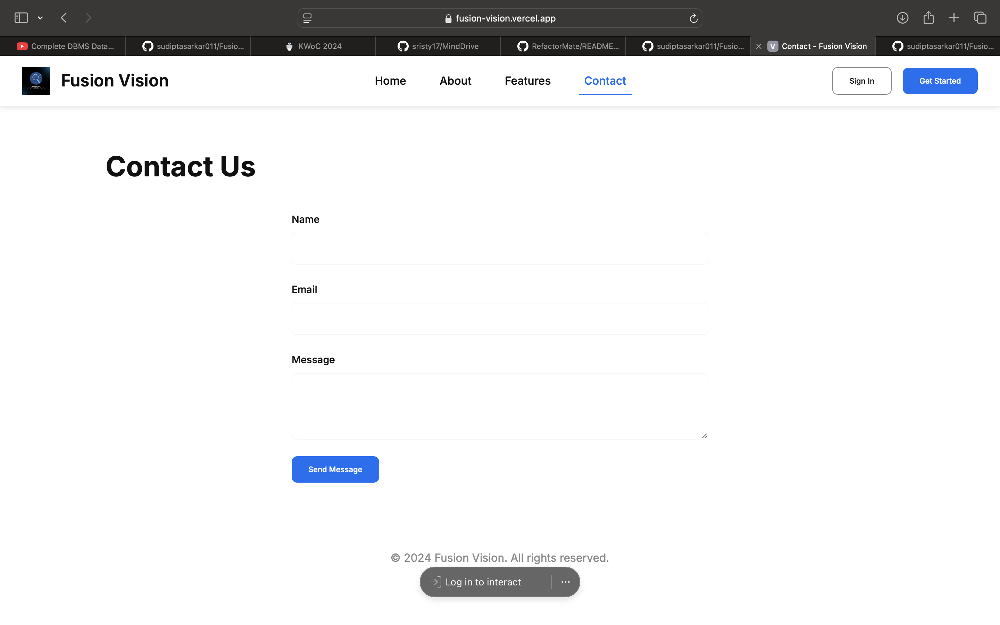

# Fusion Vision

A real-time object detection system with voice narration capabilities. The aim is to create a Social Media Platform for the visually impaired where they can upload their photos and get the description of the image in voice. Also they can share their photos with their friends and family and checkout the photos from others and know the updates of their surroundings.


## Features

- Real-time object detection using TensorFlow and YOLOv8
- Voice narration of detected objects
- Web-based interface for easy access
- Unique Social Media Platform for the visually impaired
- Unique profiles and verified users


## Getting Started

Follow these instructions to set up the project on your local machine.

### Prerequisites

Ensure you have the following installed:

- **Python** (>=3.7)
- **Node.js** (for web dependencies)

### Installation

1. **Clone the repository:**
   ```bash
   git clone https://github.com/yourusername/fusion-vision.git
   cd fusion-vision
   ```

2. **Install Python dependencies:**

   Create a virtual environment and activate it:
   ```bash
   python -m venv venv
   source venv/bin/activate  # On Windows use `venv\Scripts\activate`
   ```

   Install the required Python packages:
   ```bash
   pip install -r requirements.txt
   ```

3. **Install Node.js dependencies:**

   Navigate to the web directory and install dependencies:
   ```bash
   cd web
   npm install
   ```

### Dependencies

#### Core Requirements

- **TensorFlow** (>=2.0.0)
  - Deep learning framework for object detection
  - Used for running the COCO-SSD model

- **OpenCV** (>=4.8.0)
  - Computer vision library
  - Handles camera input and image processing

- **YOLOv8**
  - Advanced object detection model
  - Provides enhanced accuracy

#### Web Technologies

- **HTML5**
  - Camera API
  - Canvas for drawing
  - Speech synthesis

- **JavaScript**
  - TensorFlow.js
  - WebRTC for camera access
  - Speech synthesis API

#### Browser Requirements

- Modern web browser with:
  - WebRTC support
  - JavaScript enabled
  - Web Speech API support

### Accessibility Permissions

To ensure the application functions correctly, you need to grant the following permissions in your web browser:

- **Camera Access**: Required for capturing images and performing real-time object detection.
- **Microphone Access**: Needed if the application includes voice input features.
- **Speech Synthesis**: Ensure your browser allows speech synthesis for voice narration of detected objects.

Make sure to check your browser settings and grant these permissions when prompted.

### Running the Application

1. **Start the backend server:**
   ```bash
   python app.py
   ```

2. **Launch the web interface:**

   Open `index.html` in a modern web browser.


## Screenshots

Here are some screenshots of the application:

- **Contact Page**
  
  

- **Homepage**

  

- **Permission Request**

  


## Open Source Programs featuring Fusion Vision

- **Social Winter Of Code 2025**

  

## Contributing

Please read [CONTRIBUTING.md](CONTRIBUTING.md) for details on our code of conduct, and the process for submitting pull requests.


